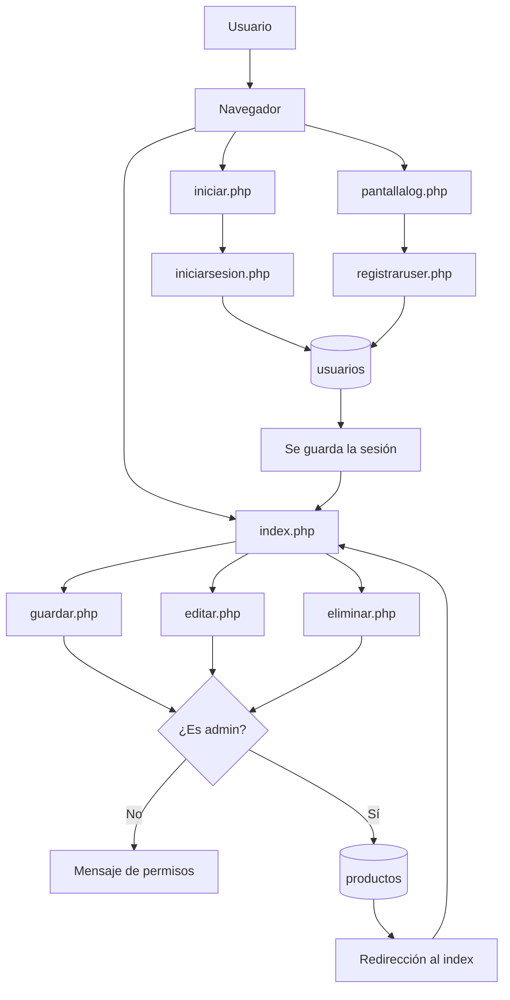

# CRUD de productos

Este proyecto es una página sencilla para ver y administrar productos.
También tiene registro de usuarios, inicio de sesión y permisos para que solamente un administrador pueda agregar, editar o eliminar productos.

## Cómo funciona

El usuario entra desde el navegador y completa alguno de los formularios. El formulario manda los datos a un archivo PHP. Ese archivo procesa la información y, cuando corresponde, consulta la base de datos `mi_base`.

Después de iniciar sesión, se guardan algunos datos en la sesión:

- El id del usuario.
- El nombre de usuario.
- El rol del usuario.

Con el rol se verifica si la persona puede modificar los productos.

## Flujo de información

## Archivos principales

- `index.php`: muestra la lista de productos.
- `iniciar.php`: muestra el formulario para iniciar sesión.
- `iniciarsesion.php`: comprueba los datos del login.
- `pantallalog.php`: muestra el formulario de registro.
- `registraruser.php`: guarda un usuario nuevo.
- `agregar.php`: formulario para agregar un producto.
- `guardar.php`: guarda el producto en la base de datos.
- `editar.php`: muestra el formulario para modificar un producto.
- `actualizar.php`: guarda los cambios del producto.
- `eliminar.php`: elimina un producto si el usuario es administrador.
- `auth.php`: inicia la sesión y comprueba el rol de administrador.
- `logout.php`: cierra la sesión.
- `conexion.php`: conecta PHP con MySQL.
- `encabezado.php` y `pie.php`: contienen las partes repetidas de la interfaz.
- `style.css`: contiene los estilos de la página.

## Roles

Los usuarios normales pueden ver los productos. Los usuarios con rol `admin` también pueden agregar, editar y eliminar productos.
