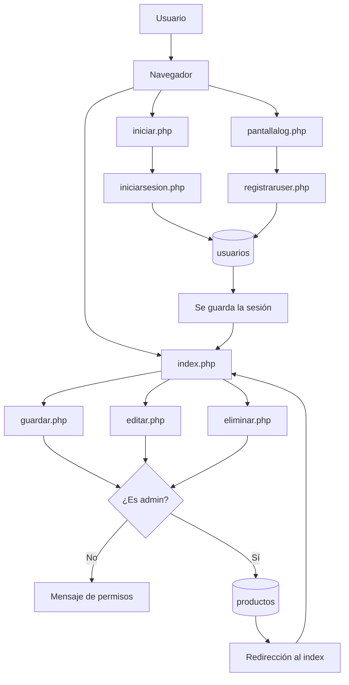

## Flujo de información

```mermaid
flowchart TD
    A[Usuario] --> B[Navegador]
    B --> C[index.php]

    B --> D[iniciar.php]
    D --> E[iniciarsesion.php]
    E --> F[(usuarios)]
    F --> G[Se guarda la sesión]
    G --> C

    B --> H[pantallalog.php]
    H --> I[registraruser.php]
    I --> F

    C --> J[guardar.php]
    C --> K[editar.php]
    C --> L[eliminar.php]

    J --> M{¿Es admin?}
    K --> M
    L --> M

    M -- No --> N[Mensaje de permisos]
    M -- Sí --> O[(productos)]
    O --> P[Redirección al index]
    P --> C
```

Los usuarios normales pueden ver los productos. Los usuarios con rol `admin` también pueden agregar, editar y eliminar productos.
